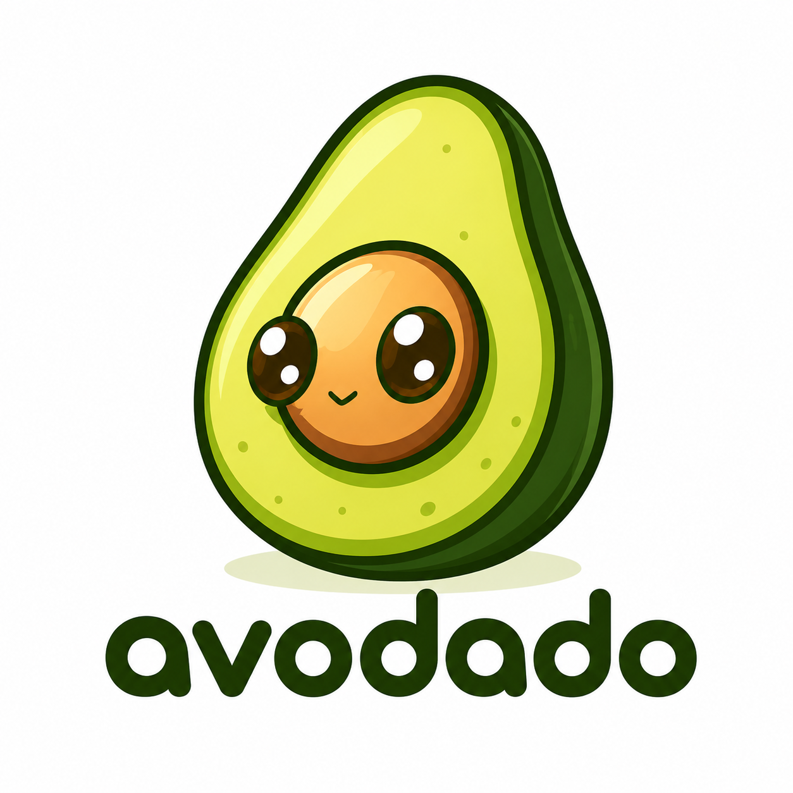

<p align="center">
  
</p>

<h1 align="center">Avodado</h1>

<p align="center">
  <a href="https://www.npmjs.com/package/@avodado/cli"></a>
  <a href="./LICENSE"></a>
  <a href="https://www.npmjs.com/package/@avodado/core"></a>
  <a href="https://nodejs.org"></a>
  <a href="https://pnpm.io"></a>
</p>

**Documentation-as-code.** Plain Markdown with typed, fenced YAML blocks. The files on disk are the only source of truth — the CLI, any AI agent, an [MCP server](./packages/mcp), and any UI are all just editors and consumers of those files.

````
docs/orders.md
─────────────
## Request flow

```sequence
id: seq-place-order
title: Place order
endpoint: { method: POST, path: /orders }
actors:
  - { id: Client, name: Client }
  - { id: API, name: Orders API }
messages:
  - { from: Client, to: API, label: POST /orders, kind: sync }
  - { from: API, to: Client, label: 201 Created, kind: response }
```
````

Anywhere prose belongs, it's plain Markdown. Anywhere structure belongs (a diagram, a table, a user story, a chart), it's a fenced block whose info-string is the block type, with a YAML body.

## How it works

1. **Write** `docs/*.md` — normal Markdown, plus fenced blocks (` ```sequence `, ` ```erd `, ` ```table `…) for anything structured.
2. **Check** — `avo check` validates every block's schema and your `doc#id` cross-references, printing precise, fixable diagnostics (line, column, "did you mean?"). Gate CI on it.
3. **Render** — `avo render` / `avo preview` turn a doc into a styled, self-contained HTML page (6 themes, inline SVG diagrams, no runtime).

The `.md` files are the **source of truth**. Humans edit them in any editor; AI agents author them via the bundled skill (`avo init`) or the [MCP server](./packages/mcp). Same files, many editors.

## Quick start

```bash
pnpm add -D @avodado/cli              # or npm / yarn
pnpm exec avo init                    # scaffold docs/, config, skill, editor adapters
pnpm exec avo check                   # validate (exits non-zero on any error)
pnpm exec avo render docs/orders.md -o orders.html
pnpm exec avo export 'docs/**/*.md' --format pdf --out dist/
```

`avo init` is an interactive wizard — it asks which AI tools you use and which theme you want, then scaffolds:

- `.avodado/skill/SKILL.md` — the authoring skill (block grammar + worked examples for all 46 blocks)
- **editor adapters** for the tools you pick — Claude Code (`CLAUDE.md`), Cursor (`.cursor/rules/avodado.mdc`), GitHub Copilot (`.github/copilot-instructions.md`), Windsurf (`.windsurfrules`)
- `avodado.theme.json` when you choose a non-default or custom theme

…so any AI agent in your repo can author Avodado docs immediately. Pass `--yes` to skip the wizard and scaffold with defaults (handy in CI).

## Use it from any AI client (MCP)

[`@avodado/mcp`](./packages/mcp) exposes the doc tooling — validate, render, block schemas, the authoring guide — over the Model Context Protocol:

```bash
claude mcp add avodado -- npx -y @avodado/mcp
```

```jsonc
// Claude Desktop / Cursor
{ "mcpServers": { "avodado": { "command": "npx", "args": ["-y", "@avodado/mcp"] } } }
```

## The 46 block types

| Family | Blocks |
|---|---|
| Document & meta | `meta` |
| Prose & structure | `prose` `callout` `glossary` `pullquote` `layers` |
| Tables & metrics | `table` `stats` `code` |
| API reference | `endpoint` |
| Sequence & state | `sequence` `state` |
| Data model | `erd` |
| Architecture | `c4` `block` `infra` `event` `ddd` `network` `cluster` |
| Code-flavoured | `felogic` `belogic` `frontend` `uml` `dag` |
| Flow & process | `flow` `dfd` `swimlane` |
| Charts & overviews | `graph` `mece` `tree` `gantt` `pyramid` `quadrant` `journey` |
| Planning & meta | `userstory` `timeline` `kanban` `tracker` `cvt` `proscons` `agenda` |
| UI mockups | `wireframe` |

Full schemas with worked examples live in `.avodado/skill/SKILL.md`.

## Themes

Six built-in themes — pass via `renderDocument(doc, { theme })` or `avo render --theme`:

| Theme | Look |
|---|---|
| `textbook` | Warm classic (default) — cream paper, deep academic navy + terracotta, serif display & body, large headings |
| `minimal` | Clean modern — white, near-black ink, single blue accent, geometric sans |
| `soft` | Modern light — indigo accent, rounded surfaces, sans display |
| `dark` | Full dark mode |
| `teal` | Teal + amber highlight |
| `plum` | Plum + pink highlight |
| `slate` | Slate sans — Helvetica display, teal highlight |

Themes override CSS variables on the `.docskin` root, so SVG diagrams retint along with the prose.

## Cross-references (`doc#id`)

Any block may carry a top-level `id:`. Other blocks reference it as `doc#id` (or `#id` for the same document):

```userstory
id: US-142
role: shopper
want: pay in one step
soThat: I can complete my purchase quickly
links:
  - { ref: orders-api#seq-place-order, label: Request flow }
```

- Ids are **repo-global unique**. Duplicate id → `avo check` fails with both file/line locations.
- A `ref` pointing at an id that doesn't exist → `avo check` fails with the file, line, and the offending ref string.

CI gates on this naturally: `avo check` exits non-zero on any error.

## Packages

| Package | Purpose |
| --- | --- |
| [`@avodado/core`](./packages/core) | Parser, Zod block schemas (all 43 types), validation, reference resolver. Pure (no I/O). |
| [`@avodado/render`](./packages/render) | `renderDocument` (standalone HTML) + `renderDocumentParts` (embeddable). Inline CSS + SVG, 6 themes. |
| [`@avodado/export`](./packages/export) | `toHtml(doc)` + `toPdf(doc)` (Playwright headless Chromium). |
| [`@avodado/cli`](./packages/cli) | `avo` — `init / new / check / render / export / preview / sync`. |
| [`@avodado/sync`](./packages/sync) | Generate Avodado docs from external sources (OpenAPI). |
| [`@avodado/mcp`](./packages/mcp) | Model Context Protocol server exposing the doc tooling to any MCP client. |

## CLI reference

```
avo init                              # scaffold docs/, config, skill, editor adapters
avo new --type sequence --out docs/orders.md   # new doc from a block template
avo new --type adr --out docs/adr-001.md       # new doc from a document template
avo check                             # validate all docs (default: docs/**/*.md)
avo check --json                      # machine-readable diagnostics
avo render docs/orders.md -o out.html
avo html docs/orders.md               # one doc → HTML   (shortcut)
avo slides docs/plan.md               # one doc → slide deck (one slide per section)
avo slides docs/plan.md -p            # …and open it in the browser (-p / --preview)
avo pdf docs/plan.md                  # one doc → PDF
avo claude                            # install/update the skill + Claude Code adapter (also: cursor, github, windsurf)
avo export 'docs/**/*.md' --format html,pdf,slides --out dist/   # batch, multiple formats
avo preview docs/orders.md            # render to a temp file and open it
avo sync openapi spec.yaml --out docs/api.md
```

Exit codes: `0` clean · `1` errors present · `2` CLI usage error. Set `AVO_PLAIN=1` (or run in CI) to force plain output in a TTY.

## Architecture, in one paragraph

`@avodado/core` parses Markdown into segments (prose or typed blocks). The **block registry** in core is a `Record<BlockType, BlockDef>` — adding a block type requires updating the schema and every rendering registry in lock-step (omitting one is a compile error). The renderer turns a Document into HTML via a parallel `Record<BlockType, (data) => string>` map; export wraps render with a PDF path; the CLI wires it together with I/O; the MCP server exposes it to agents. Dependencies always point inward to `core`; only the CLI throws and sets exit codes. See [`ARCHITECTURE.md`](./ARCHITECTURE.md).

## Development

```bash
pnpm install
pnpm typecheck      # all packages
pnpm test           # vitest across all packages
pnpm lint           # ESLint + typescript-eslint
pnpm build          # tsup, ESM
```

PDF export needs Chromium once: `npx playwright install chromium`.

## License

[MIT](./LICENSE)
