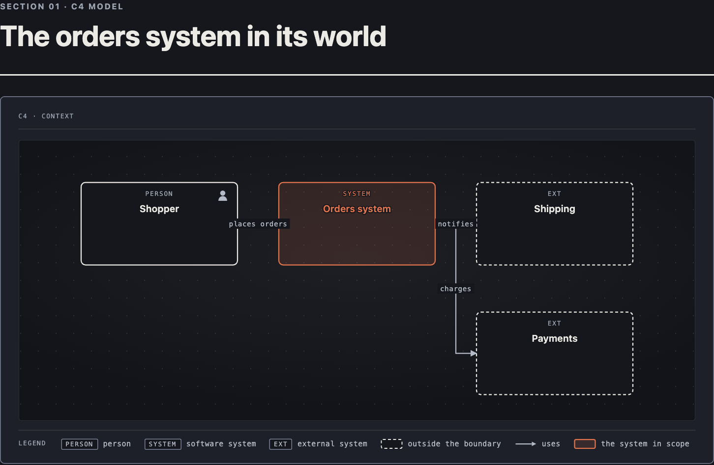
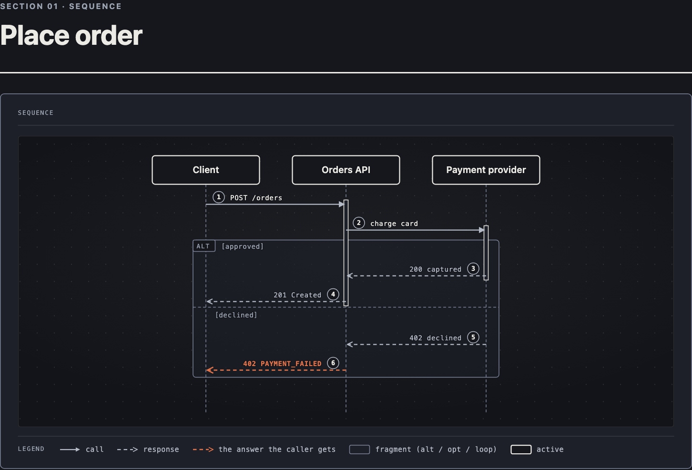
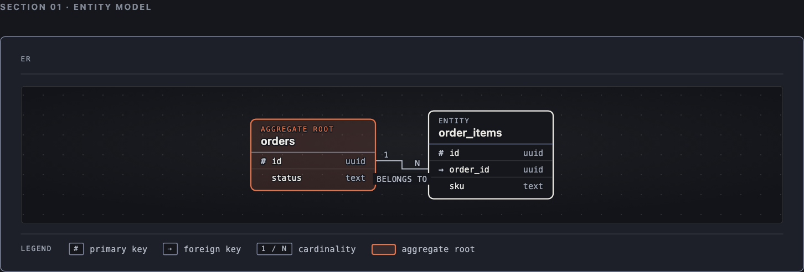
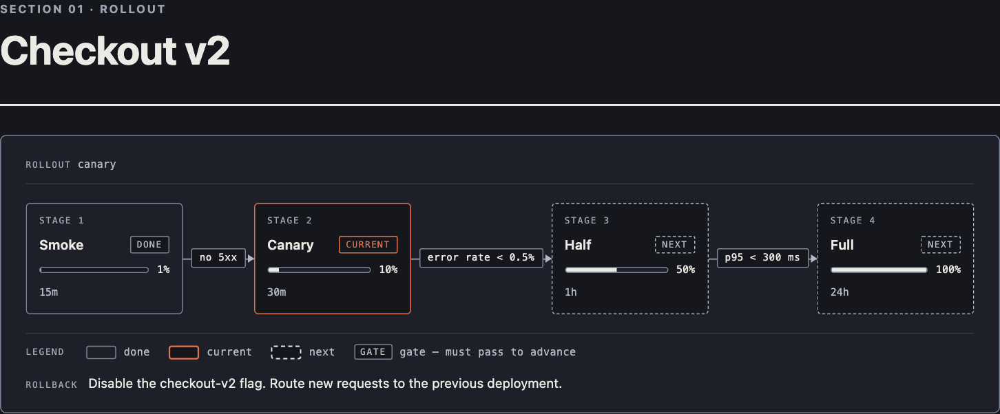
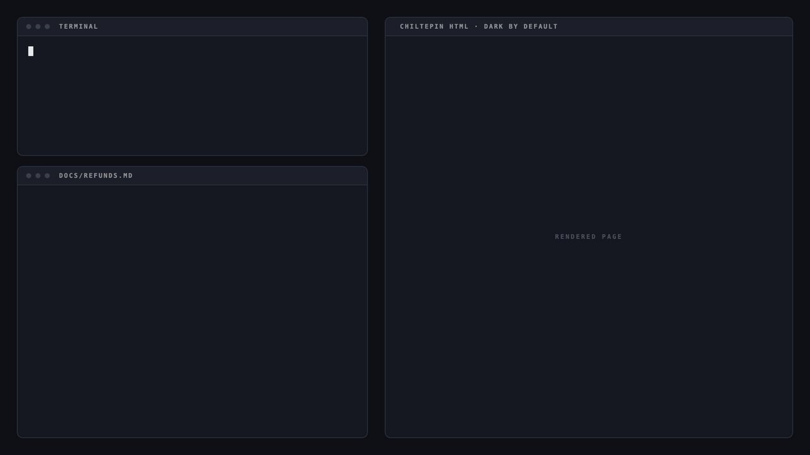

<p align="center">
  
</p>

<h1 align="center">Chiltepin</h1>

<p align="center"><strong>Docs your AI agent can write, and your CI can check.</strong><br/>Turn Markdown and typed YAML into architecture diagrams, API docs, runbooks, and slides. A growing library of typed blocks, with deterministic HTML + SVG output.</p>

<p align="center">
  <a href="https://www.npmjs.com/package/chiltepin"></a>
  <a href="https://github.com/jdiejim/chiltepin/actions/workflows/ci.yml"></a>
  <a href="./LICENSE"></a>
  <a href="https://nodejs.org"></a>
  <a href="https://github.com/jdiejim/chiltepin/tree/main/skills/chiltepin"></a>
</p>

<p align="center">
  <a href="https://chiltepin.dev">Website</a> ·
  <a href="#quick-start">Quick start</a> ·
  <a href="#examples">Examples</a> ·
  <a href="./skills/chiltepin/SKILL.md">Agent skill</a> ·
  <a href="./CONTRIBUTING.md">Contribute</a>
</p>

<p align="center">
  
</p>

**Your agent writes the content. Chiltepin handles the layout.** Keep the source in Git, review a Markdown diff, and run `chiltepin check` in CI.

```bash
npx -y chiltepin demo                    # see rendered examples without creating a project
```

Use an agent to write docs with `npx skills add jdiejim/chiltepin -g`, or follow the [manual quick start](#quick-start).

## Examples

These are screenshots from the current renderer. Open each image at full size, or follow its source link to inspect the YAML.

| Architecture and system context | Request flow with success and failure branches |
| --- | --- |
| [](./assets/examples/architecture.png) | [](./assets/examples/sequence.png) |
| [Source: system overview](./docs/examples/system-overview.md) | [Source: the example below](#what-a-doc-looks-like) |

| Database relationships | Canary rollout with explicit gates |
| --- | --- |
| [](./assets/examples/data-model.png) | [](./assets/examples/rollout.png) |
| [Source: API reference](./docs/examples/api.md) | [Source: canary rollout](./docs/examples/canary-rollout.md) |

More complete documents: [ADR](./docs/examples/adr.md), [event contract](./docs/examples/event-contract.md), [runbook](./docs/examples/runbook.md), and [slide deck](./docs/examples/presentation.md).

<details>
<summary><strong>Watch the authoring workflow</strong></summary>

<p align="center">
  
</p>

</details>

## Why Chiltepin

- **Docs you can review.** Prose, diagrams, tables, and decisions live in the same Markdown file.
- **Layout you can reproduce.** Typed content goes through deterministic renderers; the agent does not need to draw the output.
- **Validation you can automate.** `chiltepin check` fails on invalid fields and broken references. Style and density warnings help authors improve the result.
- **Several outputs from one source.** Export HTML, slides, PDF, or a static docs site. Edit the same files in Studio or your editor.

## What a doc looks like

````markdown
## Request flow

```sequence
title: Place order
actors:
  - { id: Client, name: Client }
  - { id: API, name: Orders API }
  - { id: PSP, name: Payment provider }
messages:
  - Client -> API: POST /orders
  - API -> PSP: charge card
  - alt: approved
  - PSP --> API: 200 captured
  - API --> Client: 201 Created
  - else: declined
  - PSP --> API: 402 declined
  - API --> Client: 402 PAYMENT_FAILED
  - end
```
````

Prose is plain Markdown. Anything structured is a fenced block: the info-string is the block type, the body is YAML (JSON works too) against a strict schema. Terse one-line forms cover the common items (`a -> b: label`, `Term — definition`, `[pass] item — evidence`). The `.md` files are the only source of truth; the CLI, Studio, and your agent are all editors of the same files.

## Quick start

Requires **Node.js 20 or later**. `npx` downloads the CLI on first use.

**With an agent:**

```bash
npx skills add jdiejim/chiltepin -g
```

Then ask:

> Use Chiltepin to document this project's request flow. Read the code, explain the services and data stores, include the failure path, and validate the document.

The [skill](./skills/chiltepin/SKILL.md) guides block selection, schema lookup, and validation. Review the generated content against your code.

**By hand, in your project directory:**

```bash
npx -y chiltepin init
npx -y chiltepin check
npx -y chiltepin html docs/getting-started.md -p
npx -y chiltepin studio
```

`init` writes a config and two starter docs; it skips existing files. Look up any block with `npx -y chiltepin block sequence`.

For a version pinned in your project, run `pnpm add -D chiltepin`, then use `pnpm exec chiltepin check` and `pnpm exec chiltepin studio`.

**Other AI tools:** `chiltepin skill` prints the authoring guide for tools with a system-prompt field.

## Check docs in CI

After installing the project's dependencies, run:

```bash
pnpm exec chiltepin check
```

Errors fail the command. Warnings are non-blocking by default; `--strict-prose` makes prose warnings fail too. Validation checks structure and references; reviewers still verify the technical facts.

## What you can document

| For… | Blocks |
|---|---|
| Architecture & system design | `c4` `block` `cluster` `archmap` `dfd` `erd` `usecase` `pkg` |
| Flows, state, time | `sequence` `flow` `state` `swimlane` `saga` `spans` `timing` `gitgraph` `cycle` |
| Events & messaging | `block` (`preset: event`) `eventcontract` `saga` — 12 patterns in the skill |
| API reference | `endpoint` `eventcontract` `packet` `code` |
| Quality, audits, performance | `audit` `checklist` `perfbudget` `percentiles` `threatmodel` `slo` `benchmark` `risk` |
| Charts | `chart` (bar · line · area · scatter · donut · pie · gauge · radar · waterfall · funnel · pareto · histogram · bell · boxplot · bullet) `heatmap` `sankey` `treemap` `slopegraph` `quadrant` |
| Decks & decisions | `scqa` `takeaways` `bignumber` `options` `harvey` `scorecard` `scenarios` `chevrons` `roadmap` `swot` `okr` `wardley` |
| Planning | `userstory` `storymap` `kanban` `timeline` `gantt` `rollout` `changelog` `statustable` `agenda` |
| Design systems | `wireframe` `palette` `typescale` `dodont` `inventory` `frontend` `felogic` |
| Algorithms | `array` `linkedlist` `bintree` `hashmap` `graph` |
| AI & ML | `agentloop` `trace` `prompt` `context` `neuralnet` `modelcard` |
| Prose structure | `callout` `list` `glossary` `faq` `steps` `spec` `layers` `gallery` `mindmap` `tree` `fishbone` |

Typed blocks across 13 families. Every field, enum, and terse form: `chiltepin block <type>`. Twelve old names (`infra` `event` `ddd` `network` `belogic` `dag` `waterfall` `funnel` `diff` `terminal` `mece` `tracker`) remain permanent aliases.

## Outputs

| Command | Result |
|---|---|
| `chiltepin html docs/x.md` | A standalone page with inline CSS + SVG; size depends on content |
| `chiltepin slides docs/x.md` | A self-contained deck, one slide per heading |
| `chiltepin pdf docs/x.md` | Print-ready PDF (Chromium fetched once on first use) |
| `chiltepin build` | A static docs site: index, sidebar, cross-doc links |
| `chiltepin studio` | Local editor: Home page of your docs, edit in place, Present, Export |

One look, dark by default. `"colorScheme": "light"` or `"system"` in `chiltepin.config.json` switches it; print and PDF are always light.

## How the check keeps docs honest

```bash
chiltepin check                 # docs/**/*.md
chiltepin check --json          # { code, file, line, column, message, hint, suggestions }
```

Strict schemas (an unknown field is an error, with "did you mean"), repo-global unique ids, `doc#id` references resolved across files, density caps that say how to split a crowded diagram, prose lints for long sentences and filler, and lens lints: an unlabelled `c4` arrow, a third block of the same type. The parser also repairs the one YAML trap agents hit most — an unquoted comma inside an inline map — so `label: Hold as BACKORDERED, email ETA` means what the author meant.

## Cross-references

```yaml
links:
  - { ref: orders-api#seq-place-order, label: Request flow }
```

Any block with a top-level `id:` can be referenced as `doc#id` (or `#id` in the same doc). Duplicates and dangling refs fail the check with both locations.

## Packages

| Package | Purpose |
|---|---|
| [`chiltepin`](./packages/cli) | The `chiltepin` CLI: `check · block · demo · html · slides · pdf · build · studio · init · new · audit · sync · skill` |
| [`chiltepin-core`](./packages/core) | Parser, block registry, Zod schemas, terse grammars, diagnostics. Pure, no I/O |
| [`chiltepin-render`](./packages/render) | Deterministic renderers; HTML + SVG, one editorial skin |
| [`chiltepin-studio`](./packages/studio) | The local visual editor served by `chiltepin studio` |
| [`skills/chiltepin`](./skills/chiltepin) | The agent skill: block selection, validation, and references loaded on demand |

<details>
<summary><strong>Full CLI reference</strong></summary>

| Command | What it does |
|---|---|
| `chiltepin init` | Scaffold `chiltepin.config.json` + two starter docs (`--force` overwrites) |
| `chiltepin new [name]` | Scaffold a whole doc (`adr`, `runbook`, …) or one block |
| `chiltepin check [globs]` | Validate — schemas, refs, ids, density, prose, lens lints (`--json`) |
| `chiltepin block [type]` | The reference: every type on one line, or one type's contract (`--json`) |
| `chiltepin demo [family] [-s]` | Render the built-in showcase — every block, or one family (`-s` slides) |
| `chiltepin html / slides / pdf <in>` | Render one doc (`-p` opens, `-o` writes) |
| `chiltepin <file.md>` | Render and open one doc |
| `chiltepin build` | Static site from all docs (`--out`) |
| `chiltepin studio` | The local editor (`--port`, `--no-open`) |
| `chiltepin audit [path]` | Audit a codebase and recommend which docs to write, with evidence |
| `chiltepin sync openapi\|csv\|sql\|dbml\|prisma <file>` | Generate blocks or docs from an OpenAPI spec, a CSV, or a schema |
| `chiltepin skill` | Print the skill as one document |

Exit codes: `0` clean · `1` errors · `2` usage error. `CHILTEPIN_PLAIN=1` forces plain output.

</details>

## Evaluation

The [generation evaluation](./evals/generate) records 40 plain-language requests: a selection score of 39.5/40, 33 first drafts without errors, and 40 documents validated and rendered at handoff. These are maintainer-reported development runs, including rescoring after fixes. Raw run artifacts are local, so this is not an independently reproducible benchmark result yet. See the [case set](./evals/generate/cases.yaml) and [method](./evals/generate/README.md).

## Design rules

- **Geometry is code, never prompt.** If a fix tempts you to teach the model coordinates, the fix belongs in the renderer.
- **Registries are exhaustive.** A block type exists only when it has a schema, a renderer, a skill entry, a catalog example, and a test.
- **One look.** Tokens only, no literal colours; one accent per diagram, spent on the one thing the reader must see.
- **Files are the truth.** Studio, the CLI, and agents write the same `.md`; nothing else holds state.

See [`ARCHITECTURE.md`](./ARCHITECTURE.md) and the renderer's [`DESIGN.md`](./packages/render/DESIGN.md).

## Development

```bash
pnpm install
pnpm typecheck && pnpm test && pnpm lint && pnpm build
node packages/cli/dist/bin.js check        # the repo's own docs
```

Evals live in [`evals/`](./evals): block selection and end-to-end generation. Add a scenario when you add a block. Regenerate the gallery with `pnpm screenshots` after building; it requires the CLI's optional Playwright and its Chromium browser.

## Contribute and get help

Read [CONTRIBUTING.md](./CONTRIBUTING.md) to add a block, improve a renderer, or contribute an example. [Report a bug](https://github.com/jdiejim/chiltepin/issues/new?template=bug.yml) with the smallest Markdown file that reproduces it, or [request a block](https://github.com/jdiejim/chiltepin/issues/new?template=block.yml).

If Chiltepin saves you a diagram, a star helps other people find it.

## License

[MIT](./LICENSE)
