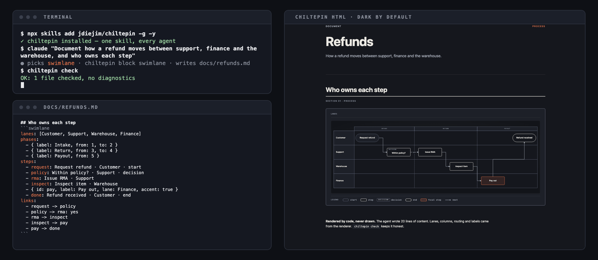

<p align="center">
  
</p>

<h1 align="center">Avodado</h1>

<p align="center"><strong>Docs your AI agent can write, and your CI can check.</strong><br/>Markdown with typed YAML blocks — 107 diagram, table, and card types — rendered by code, never drawn by the model.</p>

<p align="center">
  <a href="https://www.npmjs.com/package/avodado"></a>
  <a href="https://www.npmjs.com/package/avodado"></a>
  <a href="./LICENSE"></a>
  <a href="https://nodejs.org"></a>
  <a href="https://skills.sh"></a>
</p>

<p align="center">
  
</p>

```bash
npx skills add jdiejim/avodado -g      # give your agent the skill (Claude Code, Cursor, Codex, Copilot, 70+ agents)
```

Then ask your agent, in plain words: *"Explain the shape of the platform to a new backend engineer: services, databases, third parties."* You get a `docs/platform.md` with a C4 context diagram, a runtime topology, a request sequence, a service catalog table, and the rule that must not break — every block validated by `avo check`, rendered into the page above.

---

## Why

Diagrams-as-code tools make you write the diagram. Diagram-generating agents draw pixels and fix overlaps for four rounds. Avodado splits the job the other way round:

- **The agent writes content.** Forty lines of YAML per diagram: nodes, edges, labels, the reader's nouns. Never a coordinate.
- **The renderer owns geometry.** One block type → one deterministic renderer → one editorial look, dark by default. Labels dodge, edges route, stages grow.
- **The check is the contract.** `avo check` fails on a bad field, a broken `doc#id` reference, an unlabelled arrow, a fourth callout in a row. Every diagnostic has a stable code, a line, and the fix.

Measured on the [generation eval](./evals/generate) (38 plain-language requests, fresh agent each, no block named):

| | Avodado |
|---|---|
| Right block picked from the reader's question | 37.5 / 38 |
| First draft passes `avo check` | 32 / 38 |
| Clean at handoff, rendered | 38 / 38 |
| Tokens per document (≈ 7 blocks + prose) | ~54K |

On the eight requests a coordinate-placing diagram skill can also express, Avodado used 13% fewer tokens, finished 21% faster, and passed its own validator on the first draft 8 of 8 times against 1 of 8, while producing a whole document instead of one diagram ([method and screenshots](./.scratch/evals/archify-vs-avodado-2026-09-13)).

## What a doc looks like

````markdown
## Request flow

```sequence
title: Place order
actors:
  - { id: Client, name: Client }
  - { id: API, name: Orders API }
  - { id: PSP, name: Payment provider }
messages:
  - Client -> API: POST /orders
  - API -> PSP: charge card
  - alt: approved
  - PSP --> API: 200 captured
  - API --> Client: 201 Created
  - else: declined
  - PSP --> API: 402 declined
  - API --> Client: 402 PAYMENT_FAILED
  - end
```
````

Prose is plain Markdown. Anything structured is a fenced block: the info-string is the block type, the body is YAML (JSON works too) against a strict schema. Terse one-line forms cover the common items (`a -> b: label`, `Term — definition`, `[pass] item — evidence`). The `.md` files are the only source of truth; the CLI, Studio, the MCP server, and your agent are all editors of the same files.

## Quick start

**With an agent** (recommended):

```bash
npx skills add jdiejim/avodado -g      # once, global
# then ask for a doc; the agent runs `npx -y avodado block <type>` and `npx -y avodado check`
```

**By hand:**

```bash
npx avodado demo                 # render every block type and open it
npx avodado block sequence       # fields, terse forms, and a validating example
npx avodado check docs/          # validate; exits non-zero on any error
npx avodado html docs/x.md -p    # one doc → standalone HTML, opened
npx avodado studio               # the local visual editor over the same files
```

In a project: `pnpm add -D avodado`, `avo init` writes `avodado.config.json` and two starter docs. The skill is never copied into your repo, so the reference and the validator cannot drift apart.

**Other AIs:** `avo skill` prints the whole skill for a system-prompt box; `claude mcp add avodado -- npx -y @avodado/mcp` exposes the tooling as MCP tools.

## What you can document

| For… | Blocks |
|---|---|
| Architecture & system design | `c4` `block` `cluster` `archmap` `dfd` `erd` `usecase` `pkg` |
| Flows, state, time | `sequence` `flow` `state` `swimlane` `saga` `spans` `timing` `gitgraph` `cycle` |
| Events & messaging | `block` (`preset: event`) `eventcontract` `saga` — 12 patterns in the skill |
| API reference | `endpoint` `eventcontract` `packet` `code` |
| Quality, audits, performance | `audit` `checklist` `perfbudget` `percentiles` `threatmodel` `slo` `benchmark` `risk` |
| Charts | `chart` (bar · line · area · scatter · donut · pie · gauge · radar · waterfall · funnel · pareto · histogram · bell · boxplot · bullet) `heatmap` `sankey` `treemap` `slopegraph` `quadrant` |
| Decks & decisions | `scqa` `takeaways` `bignumber` `options` `harvey` `scorecard` `scenarios` `chevrons` `roadmap` `swot` `okr` `wardley` |
| Planning | `userstory` `storymap` `kanban` `timeline` `gantt` `rollout` `changelog` `statustable` `agenda` |
| Design systems | `wireframe` `palette` `typescale` `dodont` `inventory` `frontend` `felogic` |
| Algorithms | `array` `linkedlist` `bintree` `hashmap` `graph` |
| AI & ML | `agentloop` `trace` `prompt` `context` `neuralnet` `modelcard` |
| Prose structure | `callout` `list` `glossary` `faq` `steps` `spec` `layers` `gallery` `mindmap` `tree` `fishbone` |

107 block types across 13 families. Every field, enum, and terse form: `avo block <type>`. Twelve old names (`infra` `event` `ddd` `network` `belogic` `dag` `waterfall` `funnel` `diff` `terminal` `mece` `tracker`) remain permanent aliases.

## Outputs

| Command | Result |
|---|---|
| `avo html docs/x.md` | A standalone page: inline CSS + SVG, no runtime, ~180 KB |
| `avo slides docs/x.md` | A self-contained deck, one slide per heading |
| `avo pdf docs/x.md` | Print-ready PDF (Chromium fetched once on first use) |
| `avo build` | A static docs site: index, sidebar, cross-doc links |
| `avo studio` | Local editor: Home page of your docs, edit in place, Present, Export |

One look, dark by default. `"colorScheme": "light"` or `"system"` in `avodado.config.json` switches it; print and PDF are always light.

## How the check keeps docs honest

```bash
avo check                 # docs/**/*.md
avo check --json          # { code, file, line, column, message, hint, suggestions }
```

Strict schemas (an unknown field is an error, with "did you mean"), repo-global unique ids, `doc#id` references resolved across files, density caps that say how to split a crowded diagram, prose lints for long sentences and filler, and lens lints: an unlabelled `c4` arrow, a third block of the same type. The parser also repairs the one YAML trap agents hit most — an unquoted comma inside an inline map — so `label: Hold as BACKORDERED, email ETA` means what the author meant.

## Cross-references

```yaml
links:
  - { ref: orders-api#seq-place-order, label: Request flow }
```

Any block with a top-level `id:` can be referenced as `doc#id` (or `#id` in the same doc). Duplicates and dangling refs fail the check with both locations.

## Packages

| Package | Purpose |
|---|---|
| [`avodado`](./packages/cli) | The `avo` CLI: `check · block · demo · html · slides · pdf · build · studio · init · new · audit · sync · mcp · skill` |
| [`@avodado/core`](./packages/core) | Parser, block registry, Zod schemas, terse grammars, diagnostics. Pure, no I/O |
| [`@avodado/render`](./packages/render) | Deterministic renderers; HTML + SVG, one editorial skin |
| [`@avodado/studio`](./packages/studio) | The local visual editor served by `avo studio` |
| [`@avodado/mcp`](./packages/mcp) | MCP server exposing the tooling to any MCP client |
| [`skills/avodado`](./skills/avodado) | The agent skill: a 170-line decision path plus selection sheets per family |

<details>
<summary><strong>Full CLI reference</strong></summary>

| Command | What it does |
|---|---|
| `avo init` | Scaffold `avodado.config.json` + two starter docs (`--force` overwrites) |
| `avo new [name]` | Scaffold a whole doc (`adr`, `runbook`, …) or one block |
| `avo check [globs]` | Validate — schemas, refs, ids, density, prose, lens lints (`--json`) |
| `avo block [type]` | The reference: every type on one line, or one type's contract (`--json`) |
| `avo demo [family] [-s]` | Render the built-in showcase — every block, or one family (`-s` slides) |
| `avo html / slides / pdf <in>` | Render one doc (`-p` opens, `-o` writes) |
| `avo <file.md>` | Render and open one doc |
| `avo build` | Static site from all docs (`--out`) |
| `avo studio` | The local editor (`--port`, `--no-open`) |
| `avo audit [path]` | Audit a codebase and recommend which docs to write, with evidence |
| `avo sync openapi\|csv\|sql\|dbml\|prisma <file>` | Generate blocks or docs from an OpenAPI spec, a CSV, or a schema |
| `avo mcp` | MCP client setup; `--stdio` runs the server |
| `avo skill` | Print the skill as one document |

Exit codes: `0` clean · `1` errors · `2` usage error. `AVO_PLAIN=1` forces plain output.

</details>

## Design rules

- **Geometry is code, never prompt.** If a fix tempts you to teach the model coordinates, the fix belongs in the renderer.
- **Registries are exhaustive.** A block type exists only when it has a schema, a renderer, a skill entry, a catalog example, and a test.
- **One look.** Tokens only, no literal colours; one accent per diagram, spent on the one thing the reader must see.
- **Files are the truth.** Studio, the CLI, and agents write the same `.md`; nothing else holds state.

See [`ARCHITECTURE.md`](./ARCHITECTURE.md) and the renderer's [`DESIGN.md`](./packages/render/DESIGN.md).

## Development

```bash
pnpm install
pnpm typecheck && pnpm test && pnpm lint && pnpm build
node packages/cli/dist/bin.js check        # the repo's own docs
```

Evals live in [`evals/`](./evals): block selection, end-to-end generation, and the head-to-head. Add a scenario when you add a block.

If Avodado saves you a diagram, a star helps other people find it.

## License

[MIT](./LICENSE)
