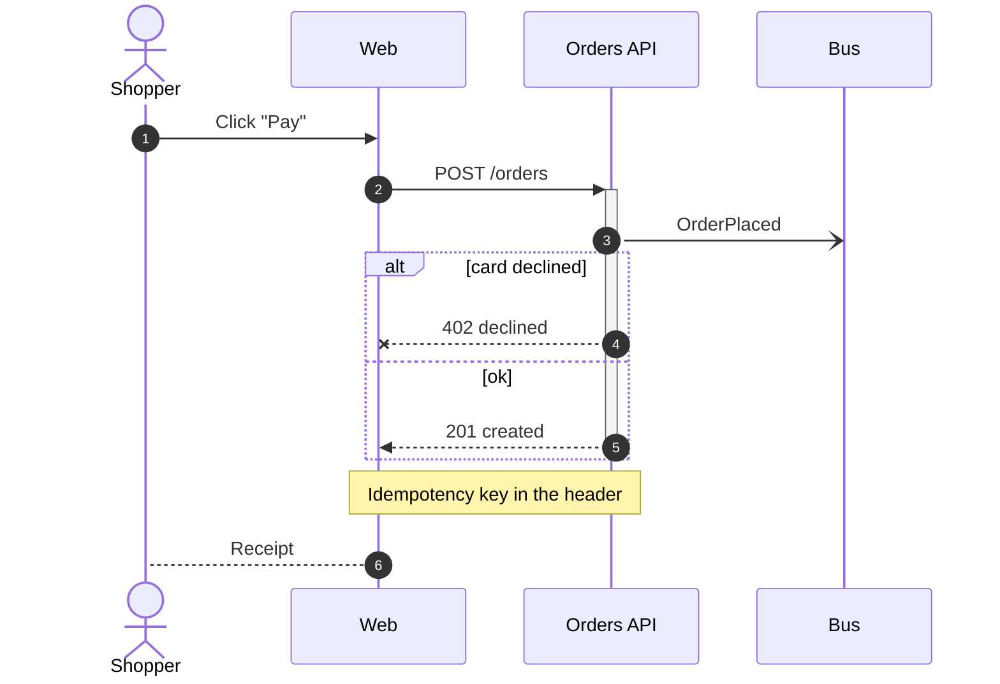
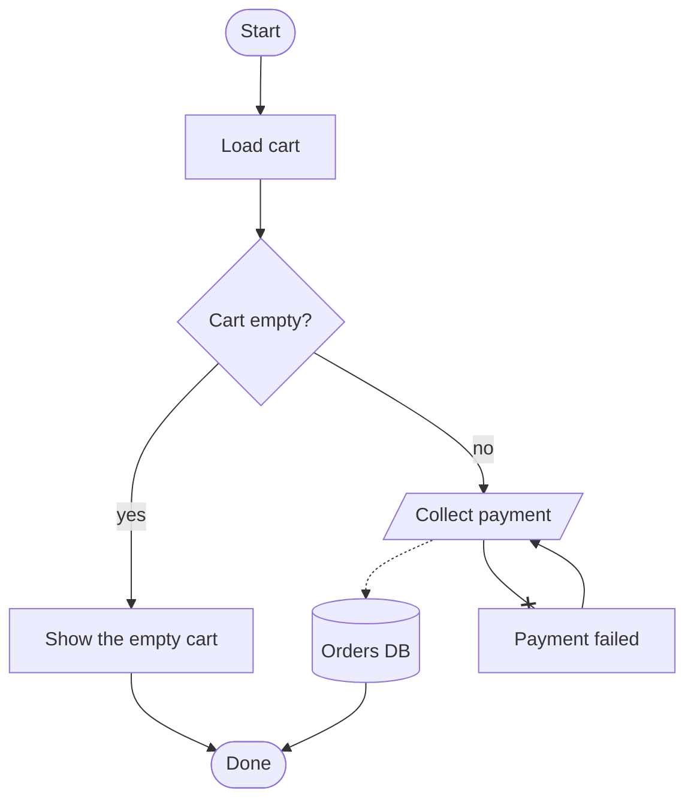
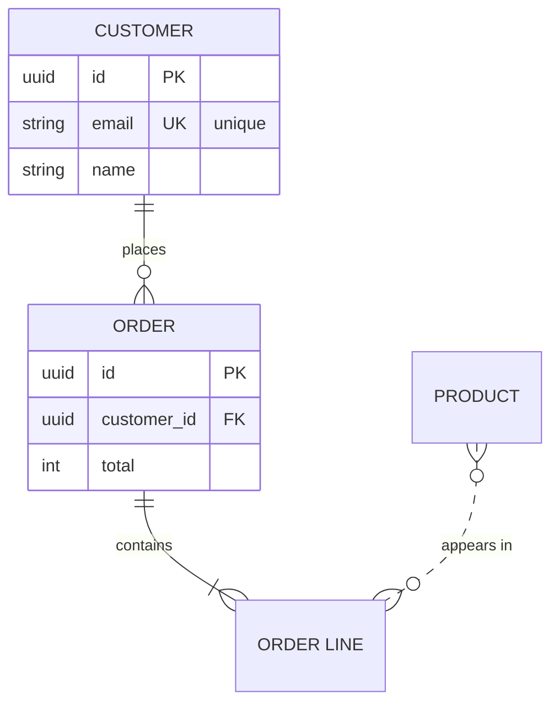
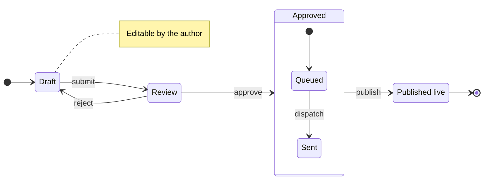
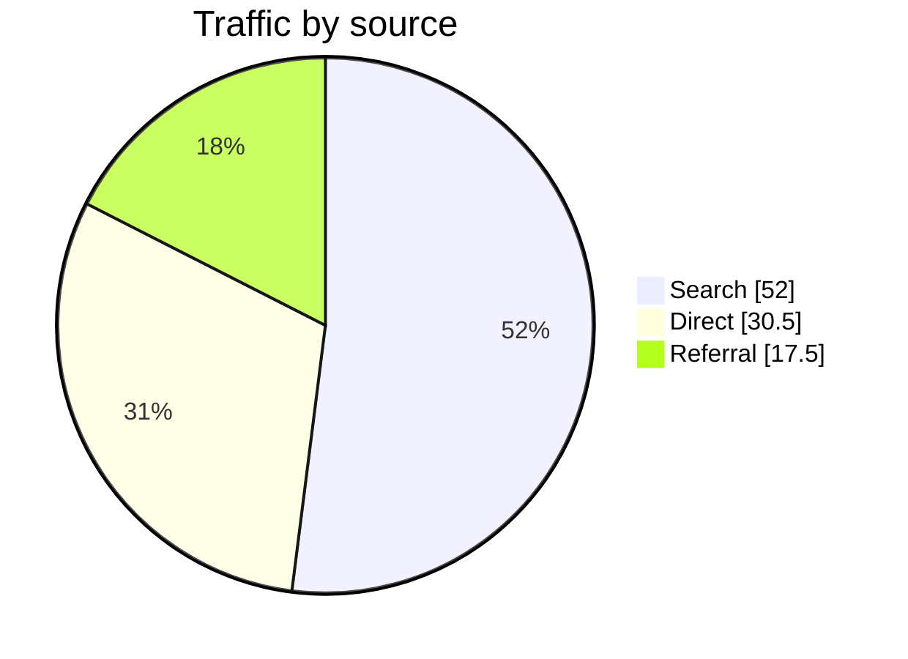

```meta
title: Mermaid input dialect
subtitle: Five Mermaid grammars that parse into typed Avodado blocks.
tag: Example
```

A ` ```mermaid ` fence whose first line is `sequenceDiagram`, `flowchart`, `erDiagram`, `stateDiagram-v2`, or `pie` parses into the matching typed block. The renderer draws it exactly like a YAML block; an edit writes it back as YAML. The subset is in `reference/mermaid.md`.

## Sequence

A checkout request with one failure branch. The `alt` frame is dropped; its messages stay.



## Flowchart

The stadium node with no incoming edge becomes `start`; the one with no outgoing edge becomes `end`. The renderer places the nodes.



## Entity model

Crow's-foot ends set the cardinality; `PK` and `FK` flags carry over.



## State machine

`[*]` becomes a start or terminal pseudo-state. The composite `Approved` is flattened; its inner `[*]` gets its own start dot.



## Pie

A pie becomes a `chart` with `kind: donut`.


